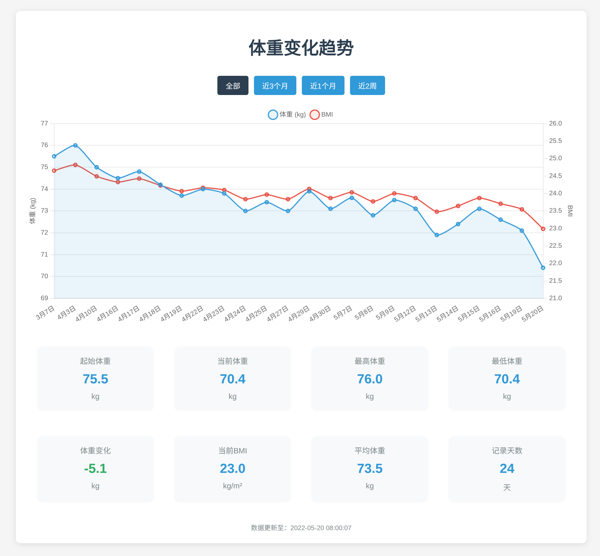

# 体重数据处理与可视化系统

这个项目是一个用于处理从小米Zepp Life APP导出的身体数据和可视化个人体重数据的完整解决方案，它可以将原始的CSV格式体重数据转换为JSON格式，筛选出每日早晨最轻的记录，并生成美观的可视化图表。

## 目录结构

```
/
├── start.sh              # 快速启动脚本
├── process-weight-data.js # 主处理脚本
├── src/                  # 源代码目录
│   ├── data/             # 数据文件目录
│   │   ├── BODY_1747705571882.csv   # 原始CSV数据文件
│   │   ├── BODY_DATA.json           # 转换后的完整JSON数据
│   │   └── BODY_MORNING_DATA.json   # 过滤后的早晨数据
│   ├── scripts/          # 数据处理脚本
│   │   ├── processWeightToJson.js   # CSV转JSON脚本
│   │   └── filterMorningWeight.js   # 过滤早晨数据脚本
│   ├── utils/            # 工具脚本
│   │   └── clean-json.js            # JSON清理工具
│   └── web/              # Web页面文件
│       ├── weight-trend.html        # 体重趋势页面
│       └── weight-chart.js          # 图表渲染脚本
└── README.md             # 项目说明文档
```

## 功能特点

1. **数据转换**：将CSV格式的原始体重数据转换为结构化的JSON格式
2. **数据过滤**：筛选每天早上7点至9点之间体重最轻的记录
3. **数据清理**：自动检测和清除JSON文件中可能存在的\r字符
4. **数据可视化**：
   - 显示体重随时间的变化趋势图
   - 支持全部/3个月/1个月/2周不同时间范围的数据筛选
   - 展示关键统计数据（起始体重、当前体重、最高/最低体重等）

## 使用方法

### 快速开始

只需执行根目录下的启动脚本：

```bash
./start.sh
```

或者直接运行主处理脚本：

```bash
./process-weight-data.js
```

### 处理流程说明

1. **检查CSV文件**：验证原始CSV文件是否存在
2. **CSV转JSON**：调用`processWeightToJson.js`将CSV数据转换为JSON格式
3. **数据过滤**：调用`filterMorningWeight.js`筛选出每天早上7-9点最轻的记录
4. **启动服务器**：在8080端口启动一个HTTP服务器
5. **打开浏览器**：自动打开默认浏览器并访问可视化页面

### 单独使用各个组件

如果想单独使用各个组件，可以按照以下方式操作：

1. **仅转换CSV到JSON**：
   ```bash
   node src/scripts/processWeightToJson.js
   ```

2. **仅过滤早晨数据**：
   ```bash
   node src/scripts/filterMorningWeight.js
   ```

3. **仅清理JSON文件中的\r字符**：
   ```bash
   node src/utils/clean-json.js src/data/文件名.json
   ```

4. **仅查看可视化页面**（需要先启动HTTP服务器）：
   ```bash
   python -m http.server 8080
   # 然后在浏览器访问：http://localhost:8080/src/web/weight-trend.html
   ```

## 数据格式要求

### 输入CSV格式

输入的CSV文件应包含以下列：
- `time`：记录时间（格式：YYYY-MM-DD HH:MM:SS）
- `weight`：体重数值（单位：kg）
- `height`：身高数值（单位：cm）
- `bmi`：BMI指数

### 输出JSON格式

转换后的JSON数据结构如下：
```json
[
  {
    "time": "YYYY-MM-DD HH:MM:SS",
    "weight": 数值,
    "height": 数值,
    "bmi": "数值字符串"
  },
  ...
]
```

## 维护与更新

如需添加新数据，请将新的CSV文件放入`src/data`目录，并确保命名为`BODY_1747705571882.csv`，
或者保持原来的名称，脚本会提示您输入文件路径。

## 系统要求

- Node.js 12.0+
- 现代浏览器（Chrome, Firefox, Safari等）
- Python 3.x（用于启动HTTP服务器）

## 故障排除

1. **文件路径问题**：
   - 确保所有文件都放在正确的目录结构中
   - 如果移动了文件，请相应地更新脚本中的路径引用

2. **CSV格式问题**：
   - 确保CSV文件的列名和数据格式正确
   - 检查数据中是否有特殊字符可能导致解析错误

3. **服务器端口冲突**：
   - 如果8080端口被占用，可以修改`process-weight-data.js`中的端口配置

## 扩展思路

1. **添加更多分析功能**：
   - 体重变化速率计算
   - BMI分类与健康建议
   - 与饮食、运动等数据的关联分析

2. **改进可视化**：
   - 添加目标线设置
   - 支持多种图表类型（柱状图、饼图等）
   - 导出图表为图片或PDF

3. **数据输入增强**：
   - 添加Web界面直接输入数据
   - 支持从更多格式导入数据（Excel, Google表格等）



